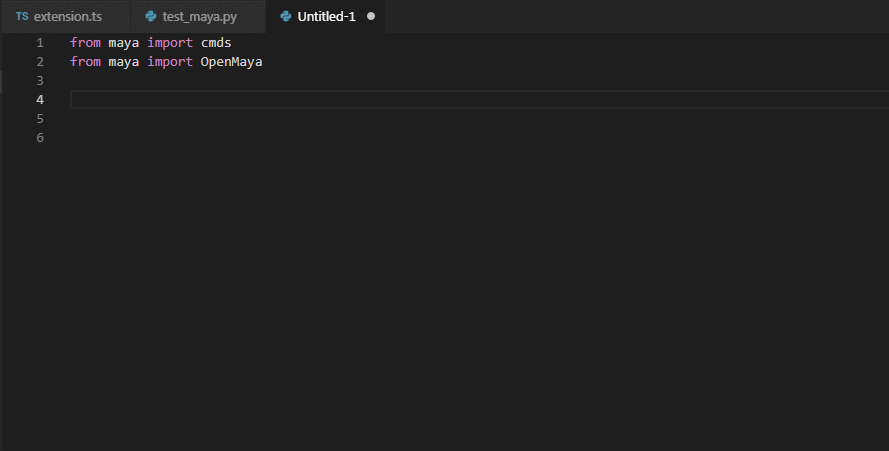
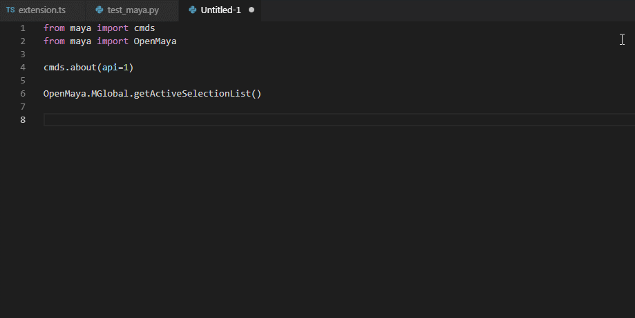
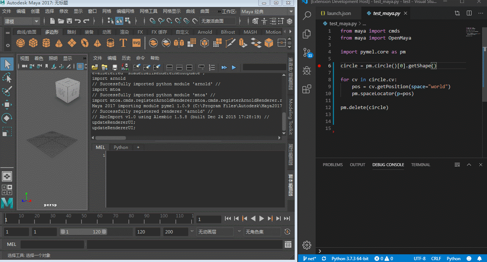
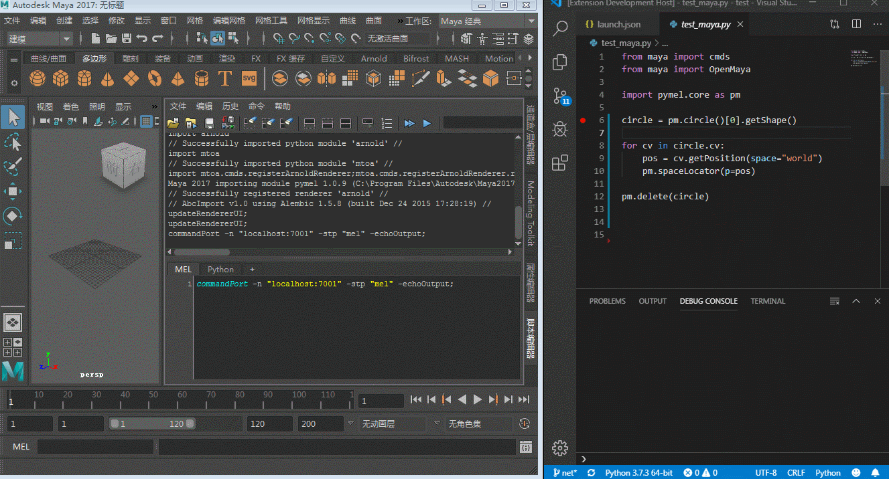
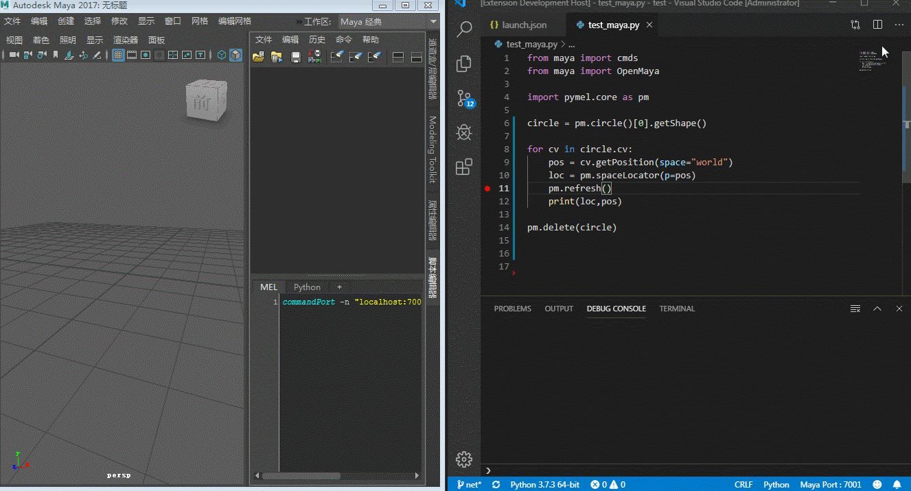
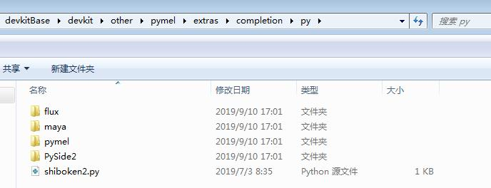

<h1 align="center">
VS Code Extension for Autodesk Maya Python Intellisense and Debugging
</h1>

<!-- This extension depend on python extension and mayaCode extension.   
add the awesome Intellisense and Debugging feature. -->

## MayaPy Feature

---

+ Add Python Intellisense for maya python module

+ Display more information without searching for document 

+ Integrate the python debugger that allow you set the breakpoint to test the code

    1. right click the menu item `Debug Current Python File to Maya `, if you didn't activate the command Port in Maya,it will tell you the mel command to activate it.
    
    

    2. if the python ptvsd debug module didn't initialize,it will import the module automatically and show the message for you.

    

    3. if all the step had been done, congratulation ,you could use breakpoint to debug your python file in Maya.

    

## Todolist

---

### Module Intellisense Feature

> Intellisense feature is completely base on the [vscode python extension](https://marketplace.visualstudio.com/items?itemName=ms-python.python) completion feature  
> The origin completion python code came from the [Maya developer center](https://www.autodesk.com/developer-network/platform-technologies/maya) devkit  
> devkit path : `devkitBase\devkit\other\pymel\extras\completion\py`

- [x] maya.cmds 
- [x] OpenMaya 1.0
- [x] OpenMaya 2.0
- [x] pymel 
- [x] pyside2

### Better Intellisense Feature

> The origin completion code already get the running module for intellisense.  
> but some module lack of the detail information for the specific function or class.  
> I try to extract more information from the Maya online document to build a better completion file.    
> [MayaDoc](https://github.com/FXTD-ODYSSEY/MayaDoc) repo is how I extract the data from the Maya online document  

- [x] maya.cmds 
    - [x] add link to the document 
    - [x] add the parameter intellisense
- [ ] OpenMaya 1.0
- [ ] OpenMaya 2.0
- [ ] pymel 
- [ ] pyside2

### Debug Feature

- [x] integrate python `ptvsd` debug module  
- [x] auto setup python debug environment  
- [x] add the debug python file button on the right click menu   
- [x] add the debug configuration snippet   

## Extensions Dependencies

---

* [Python](https://marketplace.visualstudio.com/items?itemName=ms-python.python) - Linting, Debugging (multi-threaded, remote), Intellisense, code formatting, refactoring, unit tests, snippets, Data Science (with Jupyter), PySpark and more.  
* [mayaCode](https://marketplace.visualstudio.com/items?itemName=magicstack.MagicPython) - A Visual Studio Code extension with support for coding for Maya.

